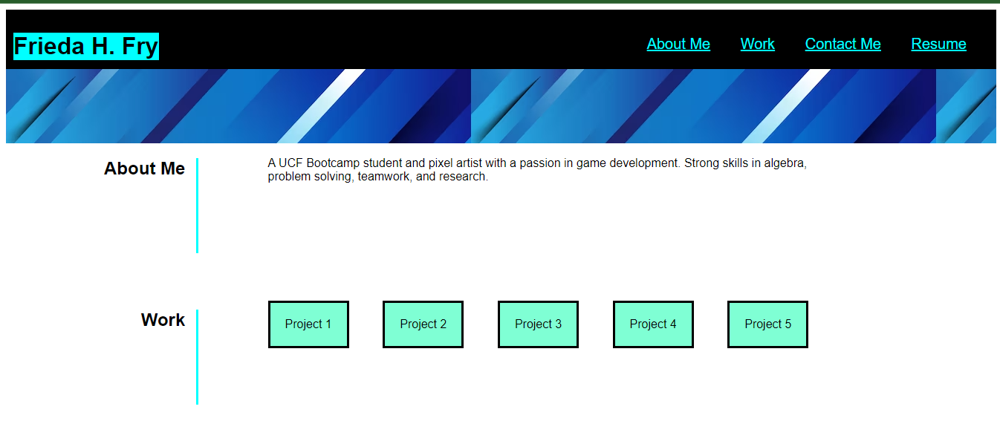
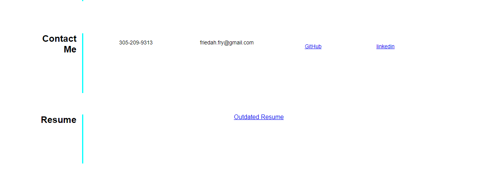

# Professional-Portfolio

A portfolio to showcase who I am professionally, the projects I have completed, my contact information, and a link to my professional resume.

# Image

# Links

Repo: https://github.com/FriedaHF/Professional-Portfolio.git
Page: 

# Reference

Code-Refactor Repo: https://github.com/FriedaHF/code-refactor.git
Youtube Tutorial: https://youtu.be/phWxA89Dy94?si=FyCcxOw7vs8Mm7qf